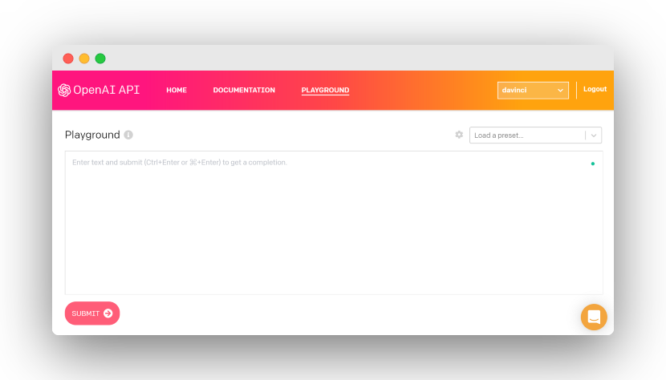

# Awesome GPT-3
> Awesome GPT-3 is a collection of demos and articles about the [OpenAI GPT-3 API](https://openai.com/blog/openai-api/).

## Demos

### App and layout tools
* [HTML layout generator](https://twitter.com/sharifshameem/status/1282676454690451457)
* [Creating app design from a description](https://twitter.com/jsngr/status/1284511080715362304)
* [React todo list](https://twitter.com/sharifshameem/status/1284421499915403264?s=09)
* [React component based on description](https://twitter.com/sharifshameem/status/1284095222939451393)
* [React component based on variable name alone](https://twitter.com/hturan/status/1282261783147958272)
* [GPT-3 generating color scales from color name or emojis](https://twitter.com/hturan/status/1282381985642614790)
* [Website generation in Figma from a description](https://twitter.com/jsngr/status/1287026808429383680)

### Search and data analysis
* [Question answering and search engine](https://twitter.com/paraschopra/status/1284801028676653060)
* [Augmenting information in tables](https://twitter.com/pavtalk/status/1285410751092416513)
* [Creating charts from a description](https://twitter.com/nutanc/status/1285436266276745221)
* [Natural-language interface to spreadsheet by generating code](https://twitter.com/itsyashdani/status/1285695850300219392)
* [Generating and iteratively updating graphs](https://twitter.com/plotlygraphs/status/1286688715167936512)
* [Guessing the movie/tv show by a description](https://www.linkedin.com/posts/mehdimabrouki_artificialintelligence-deeplearning-nlp-activity-6701068610695135232-uRur)
* [LeetCode Search: GPT-3 powered search engine for LeetCode](https://www.linkedin.com/posts/girishjeyakumar_openai-gpt3-python-activity-6888291748725035008-R0WR)

### Program generation and analysis
* [Translating natural language into shell commmands](https://twitter.com/harlandduman/status/1282132804034150400)
* [Reading code and responding to questions about it](https://twitter.com/amasad/status/1285797739930869761)
* [Generating Latex from description](https://twitter.com/sh_reya/status/1284746918959239168)
* [Generating SQL code 1](https://twitter.com/aquariusacquah/status/1284706786247880705)
* [Generating SQL code 2](https://twitter.com/FaraazNishtar/status/1285934622891667457)
* [Coding interview](https://twitter.com/lacker/status/1279136788326432771/photo/1)
* [Generating python](https://twitter.com/josephbrionesaz/status/1283097878223675392)
* [Generating database-specific SQL code](https://twitter.com/FaraazNishtar/status/1285934622891667457)
* [AI Inceptiion: GPT-3 generating machine learning code](https://twitter.com/mattshumer_/status/1287125015528341506)
* [Most Recommended Books: GPT-3 based book recommendations](http://mostrecommendedbooks.com/gpt3)
* [Extracting information from documents, powered by GPT-3](https://twitter.com/theaievangelist/status/1300862719969681411)

### Text generation
* [Translating into several languages](https://www.johnfaben.com/blog/gpt-3-translations)
* [Write this like an attorney](https://twitter.com/f_j_j_/status/1283349995144359937)
* [Automatically generating Request for Admissions](https://twitter.com/f_j_j_/status/1284050844787200000)
* [Writing full emails from key points](https://twitter.com/OthersideAI/status/1285776335638614017)
* [Simplifying legal language](https://twitter.com/michaeltefula/status/1285505897108832257)
* [Iteratively drafted non-literal poetry translation with annotations](https://imgur.com/a/3rmMVHC) 
* [Rephrasing sentences to be more polite](https://twitter.com/eturner303/status/1285342431244763136)
* [Summarizing famous people thoughts](https://twitter.com/paraschopra/status/1284423233047900161)
* [Priming GPT-3 to Speak like Any Big Five Personality](https://medium.com/intuitionmachine/priming-gpt-3-to-speak-like-any-big-five-personality-b610f5aca94f)

### Content creation
* [Content creation for marketing](https://twitter.com/Siddharth87/status/1282823354567626754)
* [Generating memes](https://twitter.com/wowitsmrinal/status/1287175391040290816)
* [Writing Google ads](https://twitter.com/Siddharth87/status/1282823360825581568)
* [Generating presentations](http://www.bemmu.com/gpt3-presentation)
* [Food recipe maker](https://twitter.com/nutanc/status/1285602813385605120)
* ["How to recruit board members"](https://twitter.com/zebulgar/status/1283927560435326976)
* [Shakespeare-style poetry generation](https://twitter.com/Merzmensch/status/1282957710024159234)
* [Generate a quiz on any topic and evaluate students answers](https://twitter.com/Learn_Awesome/status/1286189729826738176)
* [Generating history questions, with answers](https://twitter.com/mckaywrigley/status/1285827683776004096)
* [Text completion and style rewriting](https://twitter.com/IntuitMachine/status/1287050253103968257)

### General reasoning
* [Physics questions](https://www.lesswrong.com/posts/L5JSMZQvkBAx9MD5A/to-what-extent-is-gpt-3-capable-of-reasoning)
* [GPT-3 doing math](https://twitter.com/kleptid/status/1284069270603866113/photo/1)
* [Responding medical questions](https://twitter.com/QasimMunye/status/1278750809094750211)
* [Coping with non-sense questions](https://twitter.com/nicklovescode/status/1284050958977130497)
* [Reasoning questions](https://www.reddit.com/r/MachineLearning/comments/hvssqn/d_gpt3_demos/fyylreb/)
* [Working through questions in multiple steps](https://twitter.com/nnotm/status/1285915609952288770)
* [Determining food ingredients and healthiness from a picture](https://twitter.com/lawderpaul/status/1284972517749338112)
* [Psychology: neurotypical -> autistic translation](https://twitter.com/pmigdal/status/1287360452687781888)

### Game generation
* [GPT-3 generating snake game](https://twitter.com/kugos0/status/1600794621730095104)

### Other
* [GPT-3 playing chess](https://twitter.com/SRajdev/status/1287353220218662912)
* [Designing an IVR flow using natural language](https://twitter.com/nutanc/status/1287801677542612992)
* [Patient diagnosis from clinical vignettes](https://twitter.com/AndrewLBeam/status/1287772781480820737)

## Articles
* [Can GPT-3 Build a GPT-3 App?](https://medium.com/swlh/can-gpt-3-build-a-gpt-3-app-dc4d17a5b351)
* [How GPT-3 works](https://twitter.com/JayAlammar/status/1285498971960598529)
* [GPT-3 and A Typology of Hype](https://pagestlabs.substack.com/p/gpt-3-and-a-typology-of-hype?s=09)
* [GPT-3: A Hitchhiker's Guide](https://lambdalabs.com/blog/gpt-3/)
* [[Video] Paper explanation](https://www.youtube.com/watch?v=SY5PvZrJhLE)
* [Tempering Expectations for GPT-3 and OpenAI’s API](https://minimaxir.com/2020/07/gpt3-expectations/)
* [OpenAI's GPT-3 Language Model: A Technical Overview](https://lambdalabs.com/blog/demystifying-gpt-3/)
* [GPT-3: An AI that’s eerily good at writing almost anything](https://arr.am/2020/07/09/gpt-3-an-ai-thats-eerily-good-at-writing-almost-anything/)
* [GPT-3 Creative Fiction by Gwern](https://www.gwern.net/GPT-3)
* [Giving GPT-3 a Turing Test](http://lacker.io/ai/2020/07/06/giving-gpt-3-a-turing-test.html?s=09) 
* [OpenAI's GPT-3 may be the biggest thing since bitcoin](https://maraoz.com/2020/07/18/openai-gpt3/)
* [To what extent is GPT-3 capable of reasoning?](https://www.lesswrong.com/posts/L5JSMZQvkBAx9MD5A/to-what-extent-is-gpt-3-capable-of-reasoning)
* [Longevity, and resets.](https://minutes.substack.com/p/longevity-and-resets)

## Github
* [GPT-3 Sandbox: Turn ideas into demos in a matter of minutes](https://github.com/shreyashankar/gpt3-sandbox)
* [gpt-3-experiments by @minimaxir](https://github.com/minimaxir/gpt-3-experiments)
* [ChatGPT-wrapper: Use it in python and shell](https://github.com/mmabrouk/chatgpt-wrapper)

## Products
* [Tailwind CSS code generator](https://themesberg.com/blog/tailwind-css/gpt-3-tailwind-css-ai-code-generator)
* [OthersideAI](https://twitter.com/OthersideAI): Automatically write emails in your personal style by simply writing the key points you want to get across
* [Debuild](https://debuild.co): Describe what your web app should do in plain English, then start using it within seconds.
* [AI Dungeon](https://play.aidungeon.io): An AI generated text adventure that uses deep learning to create each adventure
* [WWO A/B testing OpenAI's GPT-3](https://vwo.com/ab-testing-openai-gpt-3/)
* [Presentations.ai](https://presentations.ai) Visually stunning presentations 
that you can design instantly
* [Prompts AI](https://prompts.ai): Advanced GPT-3 playground
* [AirPaper](https://airpaper.ai/): Automated document extraction powered by GPT-3
